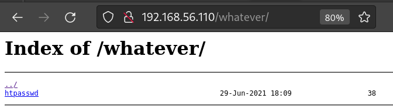
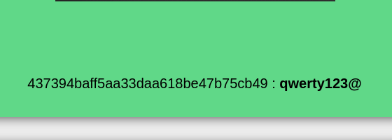

# Titre

## Enumeration

During the fuzzing campaign we found a 'admin' and 'whatever' route.

Going into /admin we find a login area

Going into /whatever we find a htpasswd file

Downloading the file we found a pair of username and encoded password:

We decode the password using MD5 decrypter and use the pair to login into the /admin page

We get the flag

