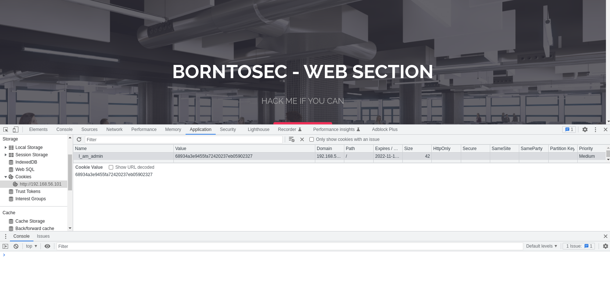
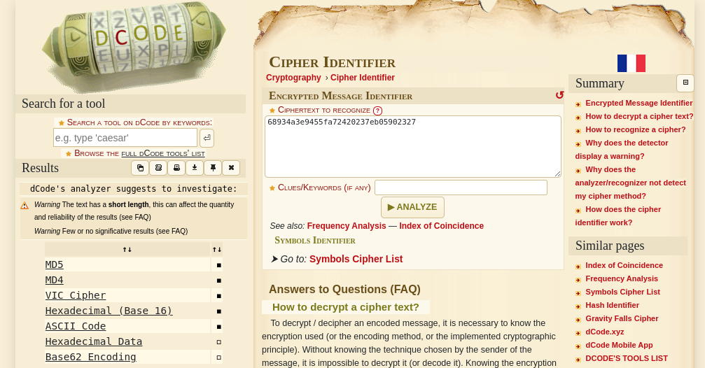
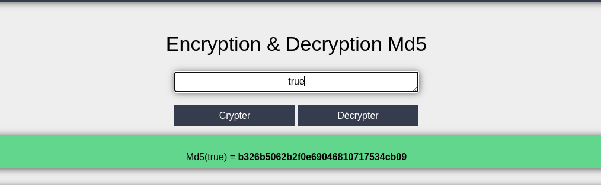

# Broken Access Control

* definition (??)

## Exploit found





## Weaknesses

* use of md5

* no back-end check for admin session

* predictable flag for admin (true/false)

## Exploitation

* change the flag for true and encrypt it with md5





## Solution

* server-side access control to prevent metadata manipulation

OR:

* use of hard cryptographic algorithm + generate random number as admin cookie + short lived cookies

## Sources

- ### Cipher-identifier
    ```
    https://www.dcode.fr/cipher-identifier
    ```
- ### Encruption and Decruption MD5
    ```
    https://md5decrypt.net/
    ```

## FLAG
[-- 🌱 --][2]

[2]: ./flag.txt