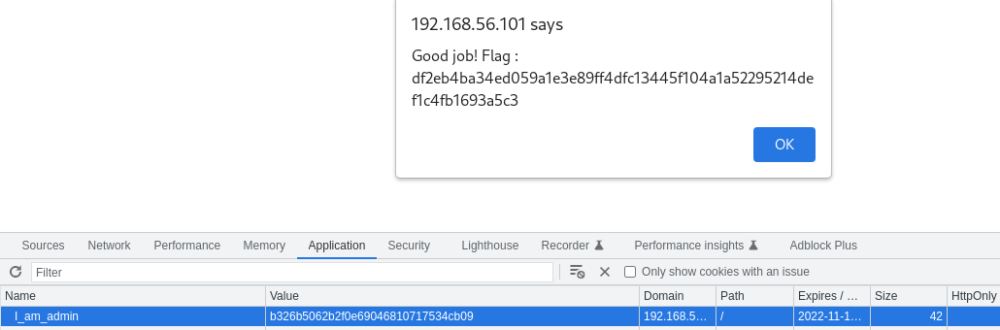

# Broken Access Control

## Page

* URL: global

## Enumeration

When inspecting the cookies stored from this website, we find a cookie named "I_am_admin"


The cookie's value is ciphered using MD5.


We know that MD5 is an outdated encryption algorithm and that weak hashes can be decrypted.

We tried to see if the hash is known to the database


## Exploitation

* We encrypt the value "true" using MD5 algorithm


* We change replace the old value with our new payload and refresh the site



## Weaknesses

* **Cryptographic failure**: MD5 is an outdated cryptographic algorithm and should not be to encrypt sensitive data.

* **Identification and Authentication failures**: The server does not verify if the user is in fact admin. The value of the cookie is too predictable and can be manipulated. 

## Solution

* Design admin privileges without tokens but with admin user instead and verify its identity at server side. The activity of the admin user should also be logged.

* If a token must be used for admin privilege than its value should be random to not be manipulated, and the token's lifetime should be short.

* Replace MD5 for hard cryptographic algorithm.

## Sources

- ### Cipher-identifier
    ```
    https://www.dcode.fr/cipher-identifier
    ```
- ### Encruption and Decruption MD5
    ```
    https://md5decrypt.net/
    ```

## FLAG
[-- 🌱 --][2]

[2]: ./flag.txt