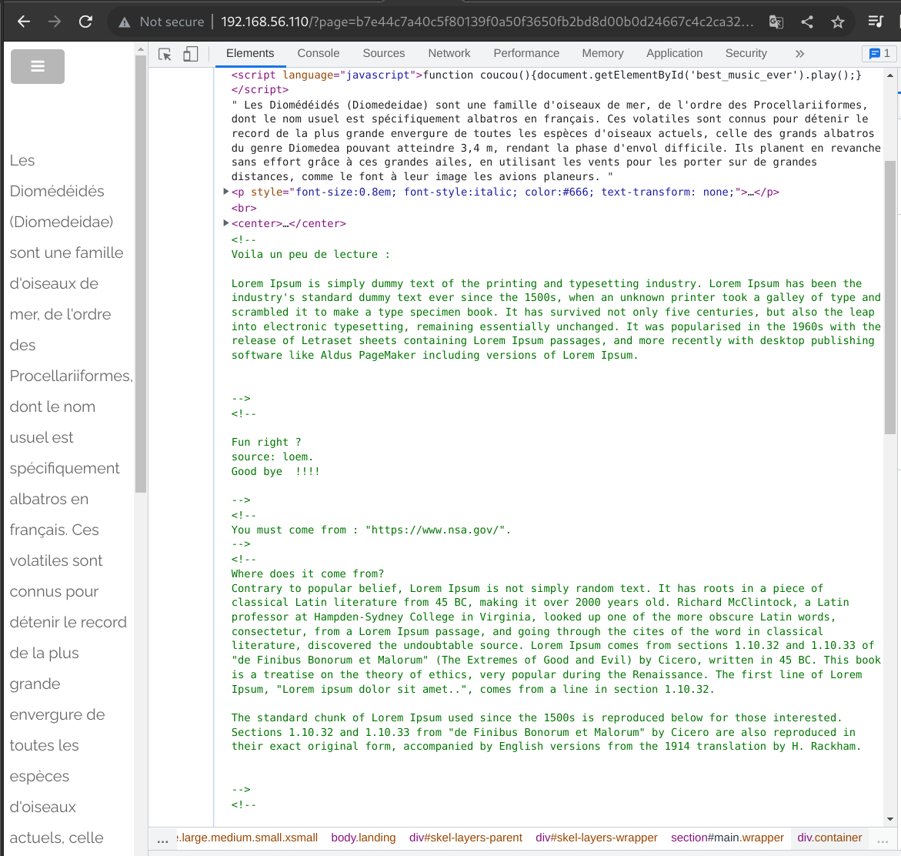

# Copyright page

## Page

* Url: http://192.168.56.101/?page=b7e44c7a40c5f80139f0a50f3650fb2bd8d00b0d24667c4c2ca32c88e13b758f

## Enumeration

The copyright page is very CTF-like. First we click on the copyright logo which direct us at the URL above.

The comments hint us to "come from" the NSA website and to use a specific browser "ft_bornToSec".

## Exploitation

To trigger the behaviour and get the flag we must modify two headers: Referer and User-Agent.

Referer header indicates to the server where the client comes from.

User-Agent header indicates information about the browser and more, that the client is using to perform the request. This way we can pretend that we are using the ft_borntoSec browser.

* We craft a GET request to the vulnerable URL according to the specific hints.

And we have the flag

.

## Weaknesses

* **Security data exposure** 

By inspecting the page, we found in the comments of the page that we can trigger a specific behaviour of the server. To do so, we need to follow the hints written in the comments.

* **Insecure design**

The behaviour we want to trigger to get the flag is based on data that can be manipulated on the client-side. As such, we can pretend to the server that coming from the NSA website and that we are using the required ft_bornToSec browser.

## Solution

* Not exposing sensitive data by removing comments in production code or by not writing sensitive data in comments at all

* The user-agent and referer data can be modified and spoofed by the client. As such, they should not be used to trigger specific behaviours that give more permissions. Do not trust client-side data!

## FLAG

[-- 🌱 --][2]

[2]: ./flag.txt
