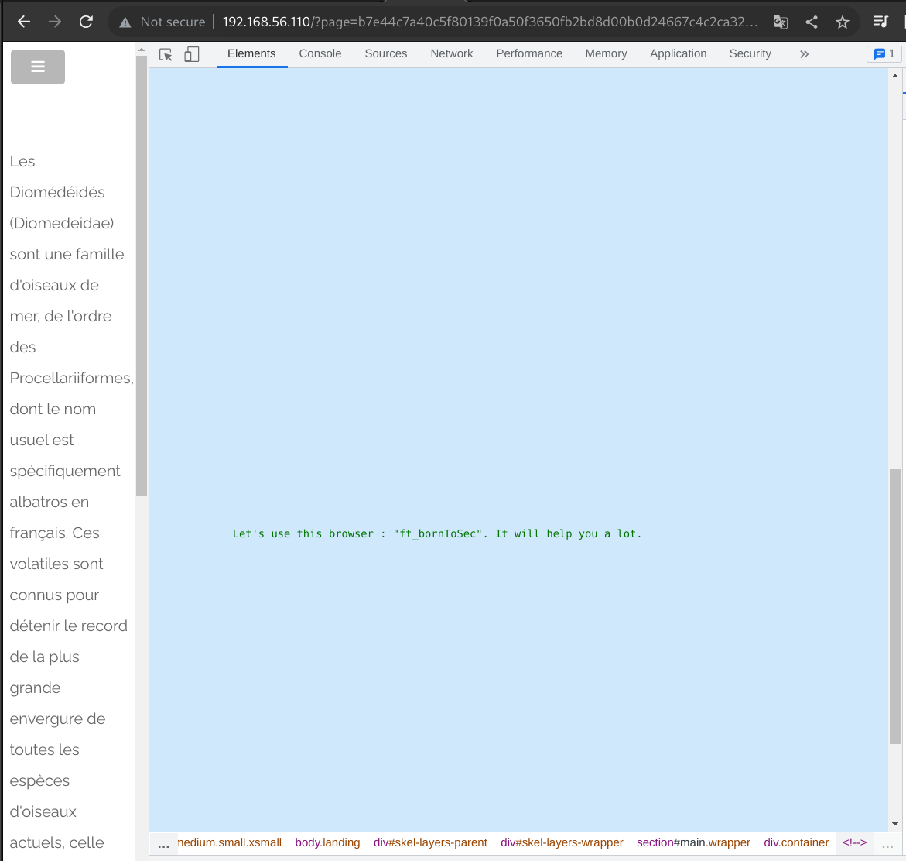
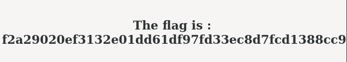

# Copyright page

## Page

* Url: http://192.168.56.101/?page=b7e44c7a40c5f80139f0a50f3650fb2bd8d00b0d24667c4c2ca32c88e13b758f

## Exploit found

The copyright page is very CTF-like. First we click on the copyright logo which direct us at the URL above.

The comments hint us to "come from" a specific url, and to use a specific browser

## Weaknesses

* Security data exposure in the comments of the page

By inspecting the page we found out that a specific behaviour of the server by coming from the nsa website and if we used a specific browser.

* Insecure design

This specific behaviour we are trying to trigger is based on client-side data and thus can be easily spoofed.

## Exploitation

To trigger the behaviour and get the flag we must send a specific GET request to the vulnerable URL and modify two headers: Referer and User-Agent.

Referer header indicates to the server where the client comes from. Thus by modifying this value we can pretend we come from the nsa website.

User-Agent header indicates information about the browser and more, that the client is using to perform the request. This way we can pretend that we are using the ft_borntoSec browser.

* We craft a GET request to the vulnerable URL according to the specific hints.

And we have the flag

.

## Solution

* Not exposing sensitive data by removing comments in production code or by not writing sensitive data in comments at all

* The user-agent and referer data can be modified and spoofed by the client. As such, they should not be used to trigger specific behaviours that give more permissions.

## FLAG

[-- 🌱 --][2]

[2]: ./flag.txt