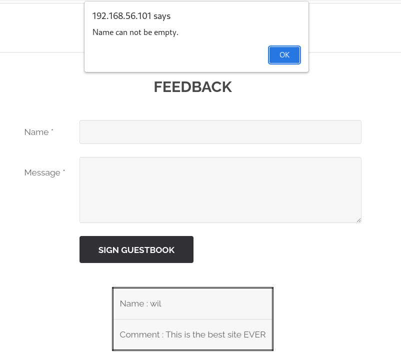
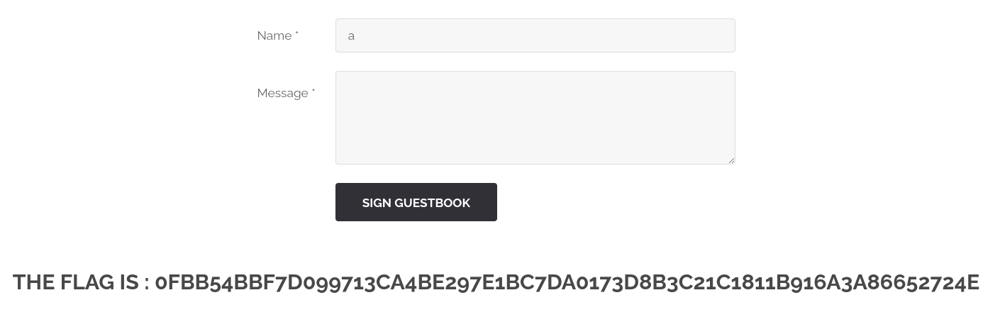

# Feedback Form

## Page

* Url: http://192.168.56.101/?page=feedback

## Exploit found

* on essaie d'envoyer un 'feedback' vide.

## Weaknesses

* No lo se

## Exploitation

* Sur la terminal on lance la [commande][1], le serveur nous [répond][2] avec le flag.

[1]: ./Resource/payload.txt
[2]: ./Resource/response.txt

### or

* On envoyant un mot commençant par a

## Solution

* No lo se

## Sources

* No lo se

## FLAG
[-- 🌱 --][3]

[3]: ./flag.txt