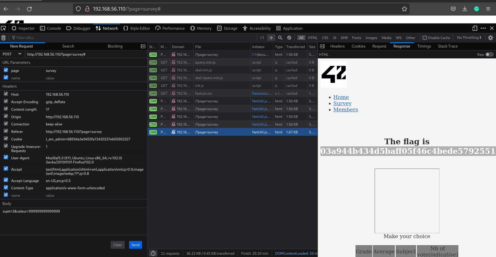

# No user input validation

url: http://192.168.56.110/?page=survey

This URL allows POST method to submit integer data as part of a survey. By modifying the value sent in the POST request, we noticed that there is no user input validation and as such we can submit any kind of integer values. We attempted to trigger an overflow with the following payload:

The payload was successful and we got the flag:

