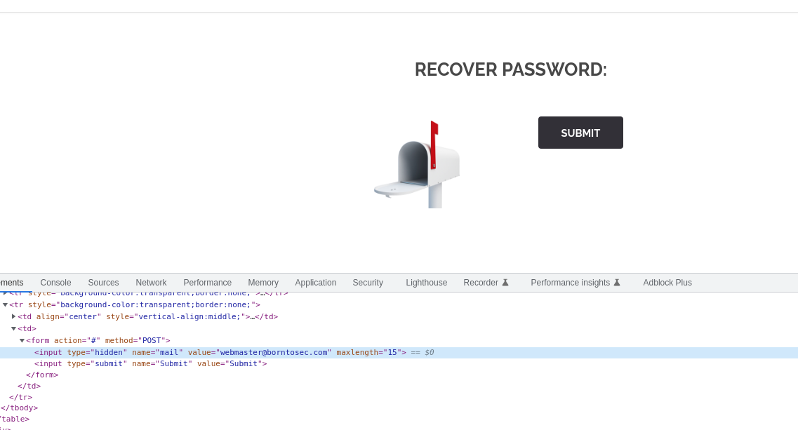
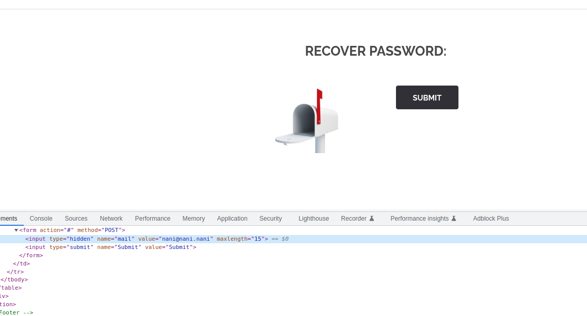
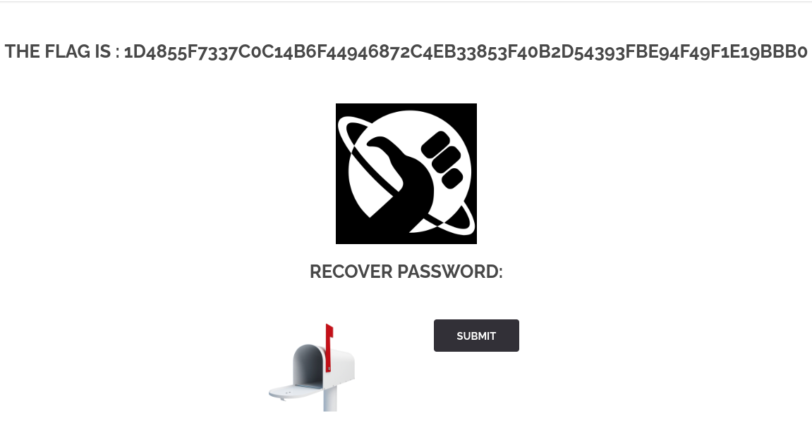

# Password reset poisoning

## Page

* Url: http://192.168.56.101/?page=recover

## Enumeration

Inspecting the recovery page, we notice the email address to which the recover password is sent.

Submitting the form we get the following page.

## Exploitation

* Change the email address to redirect to another one we own

We get the flag:

.

## Weaknesses

* **Trusting client-side data**: The reset password strategy should no integrate client-side data. Instead, the back-end should verify that the email actually exist in their database.

## Solution

* Check against the database that the email address exist.

## FLAG
[-- 🌱 --][2]

[2]: ./flag.txt
