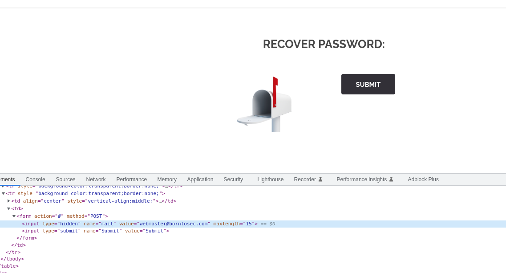
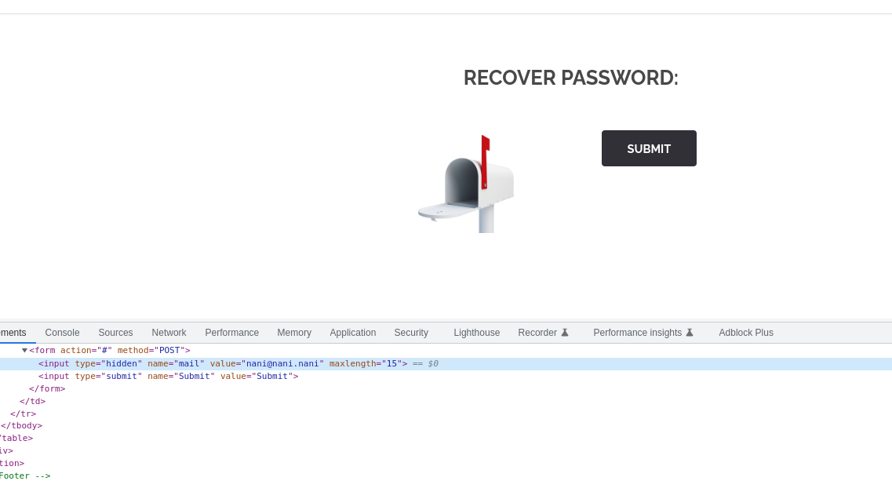
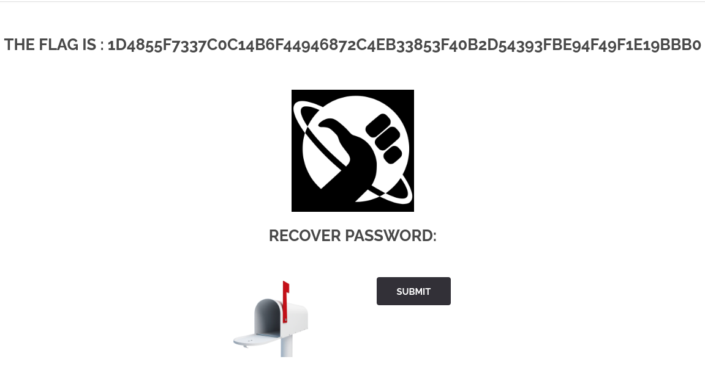

# Recover Password

* definition (??)

## Exploit found

* No lo se

## Weaknesses

* No lo se

## Exploitation

* Cambiar el value (email) donde se dirije la respuesta

.

## Solution

* No lo se

## Sources

* No lo se

## FLAG
[-- 🌱 --][2]

[2]: ./flag.txt