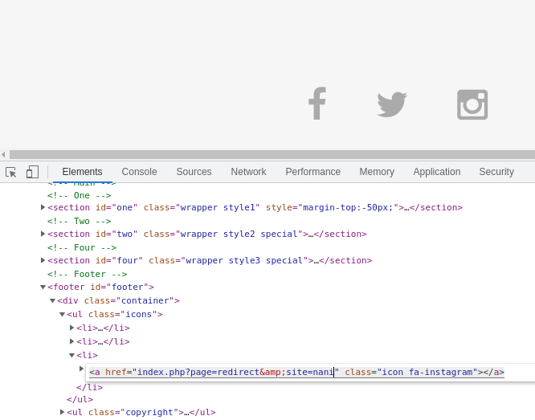
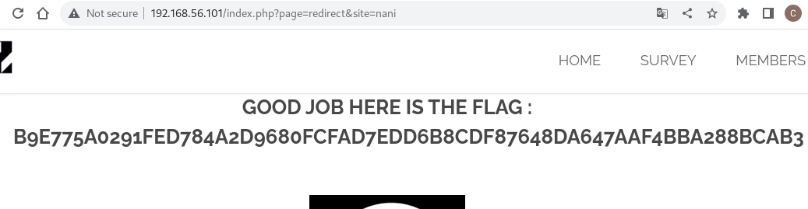

# Unvalidated redirects

## Page
* Url: http://192.168.56.101/

## Weaknesses

The web application accepts untrusted input causing a redirection to potentially untrusted URL. By modifying the target of the redirection, a malicious actor can launch a phishing scam or steal user credentials.


![Links to social accounts] (./Resource/social_icons.png)

In this case, the intended behaviour is that each icon should redirect to the relevant social account. When a icon is clicked, the following vulnerable code is executed:

```
index.php?page=redirect&site=instagram
```

## Exploitation


* Changing the value associated with the 'site' key 
I changed the redirection url of the Instagram icon to redirect to another site and it gave me the flag





## Solution

* No lo se

## Sources

* No lo se

## FLAG
[-- 🌱 --][2]

[2]: ./flag.txt